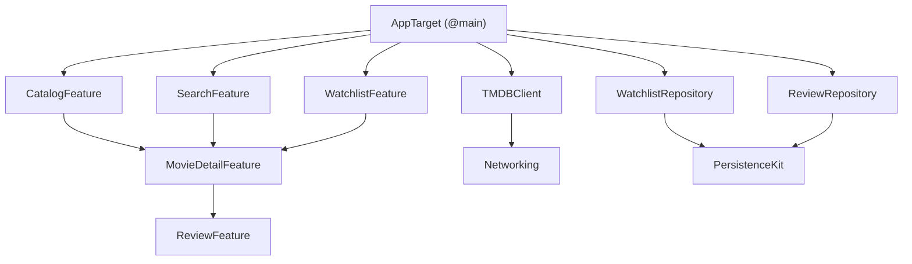
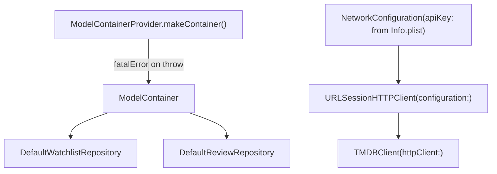

# VIPER App Bootstrap Plan

## Context

The current [`MovieTracker/MovieTrackerApp.swift`](MovieTracker/MovieTrackerApp.swift) is a partial draft that creates a `ModelContainer` and two repositories but uses SwiftUI environment injection (MVVM pattern). For the VIPER branch the DI mechanism is constructor injection into Routers. The `ContentView`, `Item.swift`, and two `EnvironmentKey` files are pre-VIPER scaffolding that will be removed.

This plan covers only the two preparatory steps required before feature work begins: removing dead scaffolding files and establishing the API key delivery mechanism via build config.

---

## Target Dependency Graph (reference)



---

## Service Construction Sequence (reference)



---

## Files to Delete

- [`MovieTracker/Item.swift`](MovieTracker/Item.swift) — Xcode template SwiftData scaffold, not part of the domain
- [`MovieTracker/ContentView.swift`](MovieTracker/ContentView.swift) — placeholder, will be superseded by `TabView` assembly once feature targets exist
- [`MovieTracker/WatchlistRepositoryEnvironment.swift`](MovieTracker/WatchlistRepositoryEnvironment.swift) — MVVM environment injection, not used in VIPER
- [`MovieTracker/ReviewRepositoryEnvironment.swift`](MovieTracker/ReviewRepositoryEnvironment.swift) — same

---

## Files to Create

### `MovieTracker/Config.xcconfig`

Delivers the TMDB base URL and API key at build time. The API key value itself is kept out of source control and provided via an environment variable or a local untracked override:

```
TMDB_BASE_URL = https://api.themoviedb.org/3
TMDB_API_KEY = $(TMDB_API_KEY_VALUE)
```

`Info.plist` gets two new entries:
- `TMDBBaseURL` → `$(TMDB_BASE_URL)`
- `TMDBAPIKey` → `$(TMDB_API_KEY)`

Both values are read in the app bootstrap via `Bundle.main.object(forInfoDictionaryKey:)`.

The `.xcconfig` file must be assigned to both Debug and Release build configurations in the Xcode project settings.

## Files to Modify

### [`MovieTracker/MovieTrackerApp.swift`](MovieTracker/MovieTrackerApp.swift)

**Remove:**
- `private struct MovieTrackerRootView` — service construction moves into `MovieTrackerApp.init()`; environment injection is not used in VIPER
- `.modelContainer(modelContainer)` scene modifier — repositories own their `EntityStore` internally; SwiftData environment injection is not needed
- Unused imports left behind by the removed struct

**Add stored properties to `MovieTrackerApp`:**

```swift
private let modelContainer: ModelContainer   // already exists
private let tmdbClient: TMDBClient
private let watchlistRepository: DefaultWatchlistRepository
private let reviewRepository: DefaultReviewRepository
```

**Rewrite `init()` to construct all services in the fixed order:**

```swift
init() {
    do {
        modelContainer = try ModelContainerProvider.makeContainer(storeType: .persistent)
    } catch {
        fatalError("ModelContainer could not be created: \(error)")
    }
    let apiKey = Bundle.main.object(forInfoDictionaryKey: "TMDBAPIKey") as? String ?? ""
    let baseURL = URL(string: Bundle.main.object(forInfoDictionaryKey: "TMDBBaseURL") as? String ?? "")!
    let httpClient = URLSessionHTTPClient(
        configuration: NetworkConfiguration(baseURL: baseURL, apiKey: apiKey)
    )
    tmdbClient = TMDBClient(httpClient: httpClient)
    watchlistRepository = DefaultWatchlistRepository.make(
        entityStore: ModelContainerProvider.makeWatchlistEntryStore(container: modelContainer)
    )
    reviewRepository = DefaultReviewRepository.make(
        entityStore: ModelContainerProvider.makeReviewStore(container: modelContainer)
    )
}
```

Note: `ModelContainerProvider.makeWatchlistEntryStore` and `makeReviewStore` are `@MainActor`. `App.init` runs on `@MainActor`, so no additional isolation annotation is needed.

**Update `body`** — `ContentView` is deleted as part of this plan; use a placeholder until `TabView` assembly is added when feature targets exist:

```swift
var body: some Scene {
    WindowGroup {
        Text("MovieTracker")
    }
}
```

**Final import list:**

```swift
import Networking
import PersistenceKit
import ReviewRepository
import SwiftData
import SwiftUI
import TMDBClient
import WatchlistRepository
```

---

## Implementation Order

1. Delete the four dead files
2. Create `Config.xcconfig` and wire it into the project build configurations
3. Add `TMDBBaseURL` and `TMDBAPIKey` keys to `Info.plist`
