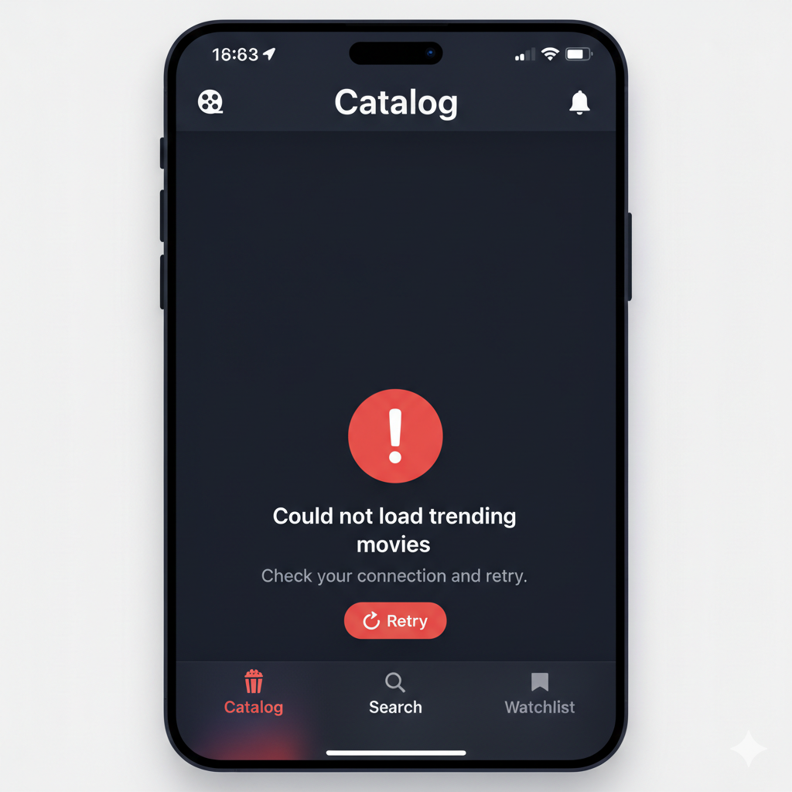
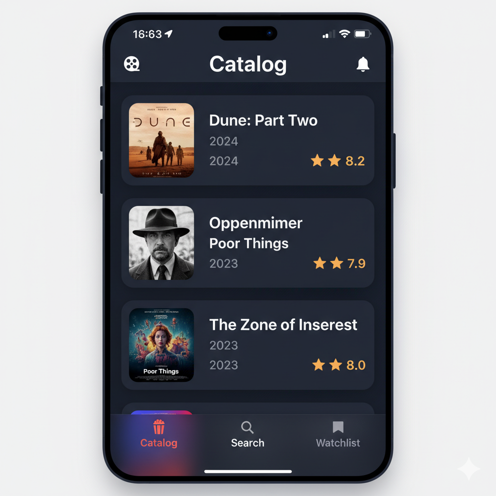

# PRD — Catalog Tab

## 1. Overview

The Catalog tab is the first tab in the three-tab root navigation and serves as the app's primary discovery surface. It presents the current week's trending movies sourced from the TMDB `/trending/movie/week` endpoint as a vertically scrollable list. No user-initiated filtering or sorting is offered — the trending order from TMDB is preserved as-is.

This document covers functional requirements, user stories, design system token references, component anatomy, and state handling specific to the Catalog tab. Shared behaviors (navigation to Movie Detail, movie card layout) are defined here with pointers to downstream PRDs where those surfaces are spec'd in full.

---

## 2. UI Mocks

> **Note:** The UI mock image (`catalog-tab-mock.png`) is generated via the Gemini image MCP tool and placed alongside this document. If the file is missing, refer to the layout specification in Section 5 for the visual structure.





---

## 3. User Stories

### US-002 — Browse trending catalog

- **Title:** View trending movies on Catalog
- **Description:** As a user, I want to see a list of trending movies for the week so I can discover titles quickly.
- **Acceptance criteria:**
  - When I open the Catalog tab, then the app requests `/trending/movie/week` and displays a scrollable list of movies from the first page of the response.
  - While the request is in flight, a loading indicator is shown and the UI does not freeze.
  - The list order matches the TMDB trending order from that response — no reordering is applied.

### US-003 — Catalog card content

- **Title:** Recognize movies from catalog cards
- **Description:** As a user, I want each catalog row to show key metadata so I can decide what to open.
- **Acceptance criteria:**
  - Each card shows: movie title, release year (derived from `release_date`), TMDB `vote_average`, and a poster image when `poster_path` is non-null.
  - When `poster_path` is null, a placeholder using `Image.film` on `.backgroundTertiary` fill is shown at the poster position.

### US-004 — Catalog network failure and retry

- **Title:** Recover from catalog load errors
- **Description:** As a user, I want to understand when trending movies cannot load and retry without restarting the app.
- **Acceptance criteria:**
  - When the `/trending/movie/week` request fails (transport error or non-2xx response), the Catalog tab shows an empty content area with an inline error message and a retry button using `Image.retry`.
  - Tapping retry re-issues the request.
  - The error state does not block tab switching or other navigation.

### US-005 — Open Movie Detail from catalog

- **Title:** Drill into a movie from the trending list
- **Description:** As a user, I want to tap a trending movie card to see its full detail screen.
- **Acceptance criteria:**
  - Tapping a catalog card navigates to Movie Detail for that movie's id.
  - Movie Detail loads `/movie/{id}` for the tapped id (see Movie Detail PRD).

### US-026 — No sort controls on catalog

- **Title:** Catalog follows TMDB trending order only
- **Description:** As a user, I should not see sort controls on the Catalog tab.
- **Acceptance criteria:**
  - The Catalog tab exposes no sort UI element.
  - The displayed order is exactly the order returned by `/trending/movie/week`.

---

## 4. Functional Requirements

### 4.1 Data loading

| Behavior | Specification |
|---|---|
| Endpoint | `GET /trending/movie/week` (first page only) |
| Trigger | View appears / tab becomes active for the first time in a session |
| Pagination | First page only; no infinite scroll, no "load more" control |
| Order | Preserve API response order exactly |
| Concurrency | Network call must not block the main thread; loading state shown during fetch |

### 4.2 States

| State | Condition | UI |
|---|---|---|
| **Loading** | Request in flight | Full-screen or list-area loading indicator; tab remains tappable |
| **Populated** | Successful response with ≥ 1 result | Scrollable `LazyVStack` of movie cards |
| **Empty** (unexpected) | Successful response with 0 results | Empty state message; no retry (not a failure) |
| **Error** | Transport error or non-2xx HTTP | Inline error message + retry button using `Image.retry`; `Color.error` tint on message |

### 4.3 Movie card

Each card in the list renders the following fields:

| Field | Source | Notes |
|---|---|---|
| Poster image | `poster_path` | Constructed as `https://image.tmdb.org/t/p/w500{poster_path}`; placeholder shown when null |
| Title | `title` | Truncated to 2 lines maximum |
| Release year | `release_date` | Extract year component only (e.g. "2024") |
| Rating | `vote_average` | Formatted to one decimal place (e.g. "8.2"), accompanied by `Image.starFilled` |

Cards are tappable targets that navigate to Movie Detail. There is no reviewed-status badge (per US-038).

### 4.4 Out of scope for this tab

- Sort controls (US-026)
- Filter controls (Search tab only)
- Pagination beyond the first TMDB page
- Pull-to-refresh (not specified in PRD; implementation may add as polish if desired)
- "Already in watchlist" or "already reviewed" visual indicators on cards

---

## 5. Screen Layout Specification

```
┌──────────────────────────────────────┐
│ StatusBar                            │
├──────────────────────────────────────┤
│ NavigationBar                        │
│  [film icon]   Catalog   [bell icon] │
│  (labelOnDark)           (labelOnDark)│
├──────────────────────────────────────┤
│                                      │
│  ┌────────────────────────────────┐  │  ← .padding(.screenEdge) horizontal
│  │ [Poster]  Title                │  │  ← card: .backgroundTertiary fill
│  │  90×135   Release Year         │  │       .cornerRadius(.large)
│  │   pt      ★ 8.2                │  │       .shadow(.card)
│  └────────────────────────────────┘  │
│                                      │
│  ┌────────────────────────────────┐  │
│  │ [Poster]  Title                │  │
│  │           Release Year         │  │
│  │           ★ 7.9                │  │
│  └────────────────────────────────┘  │
│                                      │
│  ┌────────────────────────────────┐  │
│  │ [Poster]  Title                │  │
│  │           Release Year         │  │
│  │           ★ 8.5                │  │
│  └────────────────────────────────┘  │
│                                      │
│  [ ... scrollable ... ]              │
│                                      │
├──────────────────────────────────────┤
│ TabBar: [Catalog*]  [Search]  [Watchlist] │
│          ★ accent    white     white  │
└──────────────────────────────────────┘
```

**Error state layout:**

```
┌──────────────────────────────────────┐
│ NavigationBar  Catalog               │
├──────────────────────────────────────┤
│                                      │
│         [errorCircle icon]           │
│    Could not load trending movies    │  ← .foregroundStyle(.error)
│    Check your connection and retry.  │  ← .foregroundStyle(.labelSecondary)
│                                      │
│         [ ↺  Retry ]                 │  ← .foregroundStyle(.accent) button
│                                      │
└──────────────────────────────────────┘
```

---

## 6. Design System Token Reference

### 6.1 Navigation bar

| Element | Token |
|---|---|
| Background | `.backgroundSecondary` (`#0d1b2a`) |
| Title text | `.font(.heading2)` + `.foregroundStyle(.labelOnDark)` |
| Film icon (leading) | `Image.film` + `.foregroundStyle(.labelOnDark)` |
| Bell icon (trailing) | `Image.bell` + `.foregroundStyle(.labelOnDark)` |

### 6.2 Screen background

```swift
.background(.backgroundPrimary)
```

### 6.3 Movie card

| Element | Token |
|---|---|
| Card background | `.backgroundTertiary` (`#1b263b`) |
| Card corner radius | `.cornerRadius(.large)` — 14pt |
| Card shadow | `.shadow(.card)` |
| Card padding | `.padding(.cardContent)` — 12pt all edges |
| Card-to-card spacing | `LazyVStack(spacing: .small)` — 12pt |
| List horizontal margin | `.padding(.horizontal, .screenEdge)` — 16pt |
| Poster corner radius | `.cornerRadius(.medium)` — 10pt |
| Poster placeholder fill | `.backgroundSecondary` + `Image.film` tinted `.labelTertiary` |
| Title | `.font(.heading3)` + `.foregroundStyle(.labelOnDark)` |
| Release year | `.font(.dsCaption)` + `.foregroundStyle(.labelSecondary)` |
| Star icon | `Image.starFilled` + `.foregroundStyle(.rating)` (`#f77f00`) |
| Rating value | `.font(.small)` + `.foregroundStyle(.rating)` |

### 6.4 Tab bar

| Tab | Icon | Label | Selected color | Unselected color |
|---|---|---|---|---|
| Catalog | `Image.catalogTab` (`popcorn`) | "Catalog" | `.accent` | `.labelSecondary` |
| Search | `Image.searchTab` (`magnifyingglass`) | "Search" | `.accent` | `.labelSecondary` |
| Watchlist | `Image.watchlistTab` (`bookmark`) | "Watchlist" | `.accent` | `.labelSecondary` |

### 6.5 Error state

| Element | Token |
|---|---|
| Error icon | `Image.errorCircle` + `.foregroundStyle(.error)` |
| Error headline | `.font(.heading3)` + `.foregroundStyle(.error)` |
| Error body | `.font(.dsBody)` + `.foregroundStyle(.labelSecondary)` |
| Retry button icon | `Image.retry` |
| Retry button tint | `.foregroundStyle(.accent)` |
| Retry button label | `.font(.buttonLabel)` |

---

## 7. Component Anatomy

### 7.1 `MovieCard`

Shared across Catalog, Search, and Watchlist tabs. Inputs:

```
MovieCard(
  posterURL: URL?,        // nil → show placeholder
  title: String,
  releaseYear: String,    // pre-formatted "YYYY"
  rating: String          // pre-formatted "X.X"
)
```

Internal layout: `HStack(spacing: .xSmall)` with poster on the leading side and a `VStack(spacing: .xxSmall)` for metadata on the trailing side.

### 7.2 `CatalogView` states

The view renders one of four mutually-exclusive child views driven by a view model state enum:

```
enum CatalogState {
  case loading
  case populated([Movie])
  case empty           // 0 results from a valid response
  case error(message: String, retryAction: () -> Void)
}
```

---

## 8. Non-Functional Requirements

| Requirement | Detail |
|---|---|
| Main thread safety | Network call dispatched off the main actor; state updates published on main actor |
| Image loading | Poster images loaded asynchronously; do not block list rendering |
| Accessibility | `MovieCard` is a single accessible element with a combined label: `"\(title), \(releaseYear), rated \(rating) out of 10"` |
| Minimum OS | iOS 17 |

---

## 9. Open Questions

| # | Question | Owner | Status |
|---|---|---|---|
| OQ-1 | Should pull-to-refresh be supported on the catalog list? | Product | Open |
| OQ-2 | Should the navigation bar show the app logo or a film icon? Current spec uses `Image.film`; confirm with design. | Design | Open |
| OQ-3 | Bell icon tap target — does it navigate anywhere in this release? | Product | Open (likely no-op in v1) |

---

## 10. Acceptance Checklist

- [ ] Catalog tab is tab index 0 with `Image.catalogTab` icon and "Catalog" label.
- [ ] App requests `/trending/movie/week` when the Catalog tab first appears.
- [ ] Main thread is not blocked during the request.
- [ ] Loading state is visible while the request is in flight.
- [ ] Movie cards display poster, title, release year, and `vote_average`.
- [ ] Poster placeholder renders for movies without a `poster_path`.
- [ ] List order matches TMDB response order exactly.
- [ ] No sort UI is present on the Catalog tab.
- [ ] Network failure surfaces an error message and retry button.
- [ ] Retry re-issues the `/trending/movie/week` request.
- [ ] Tapping a card navigates to Movie Detail for the correct movie id.
- [ ] No reviewed-status badge appears on any card.
- [ ] All colors, fonts, spacing, and corner radii use DesignSystem tokens as specified.
